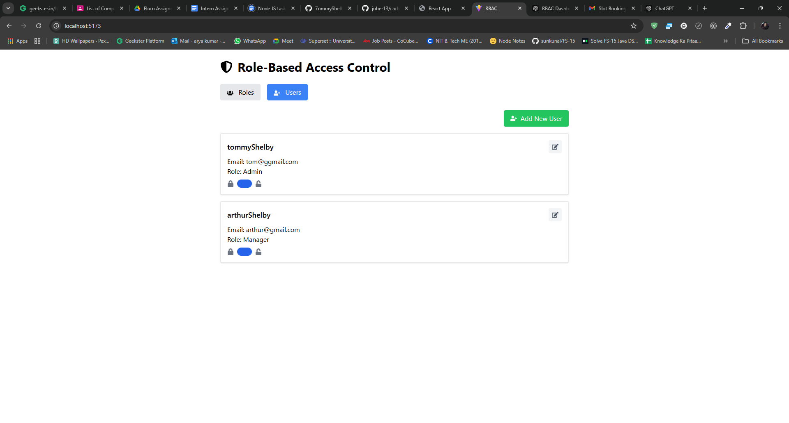

# RBAC Dashboard

The **RBAC Dashboard** is a React-based application designed for managing roles and users in a system with **Role-Based Access Control** (RBAC). It allows administrators to define roles, assign permissions, and manage users effectively.

## Features

- **Role Management**
  - View, edit, and manage permissions for roles.
  - Assign specific permissions to roles.

- **User Management**
  - Add, edit, and manage users.
  - Assign roles to users.
  - Activate or deactivate users.

- **Dynamic Permissions**
  - Toggle permissions for roles dynamically.
  - Assign users to roles based on their access level requirements.

- **Interactive UI**
  - Modals for adding and editing roles or users.
  - Intuitive tabs to switch between user and role management.

## Technologies Used

- **React**: Frontend library for building the user interface.
- **React Icons**: For interactive and visually appealing icons.
- **CSS**: For styling the components and layout.

## Setup and Installation

1. **Clone the Repository**
   ```bash
   git clone https://github.com/7ommyShelby/RBAC.git

## Usage

### Roles
1. Navigate to the **Roles** tab.
2. Edit an existing role by clicking the **Edit** button.
3. Assign or remove permissions as needed.

### Users
1. Navigate to the **Users** tab.
2. Add a new user using the **Add New User** button.
3. Edit an existing user to modify their role or status.

---

## Permissions Reference

The application supports the following permissions:

- `read:users`
- `write:users`
- `delete:users`
- `manage:roles`
- `create:projects`
- `edit:projects`
- `delete:projects`

---

## Customization

To add more permissions or roles, update the `permissionsList` or `initialRoles` variables in the code.

---

## Screenshots

### Dashboard Overview


### Edit Users

